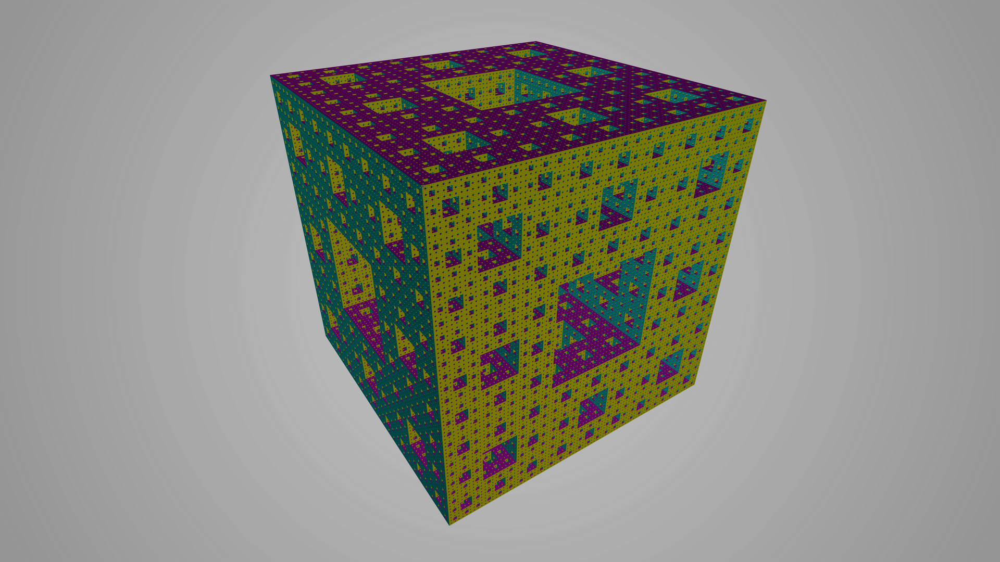
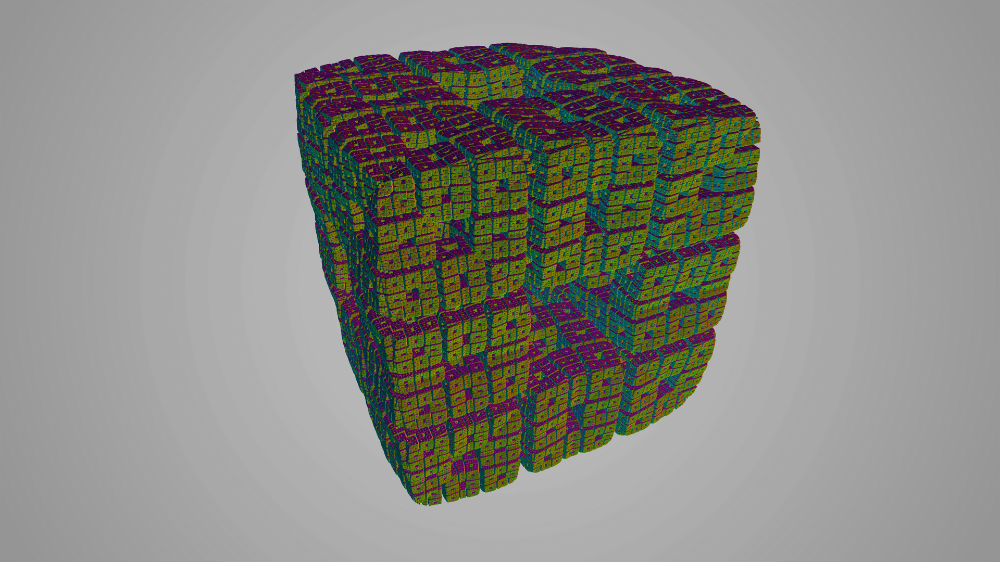
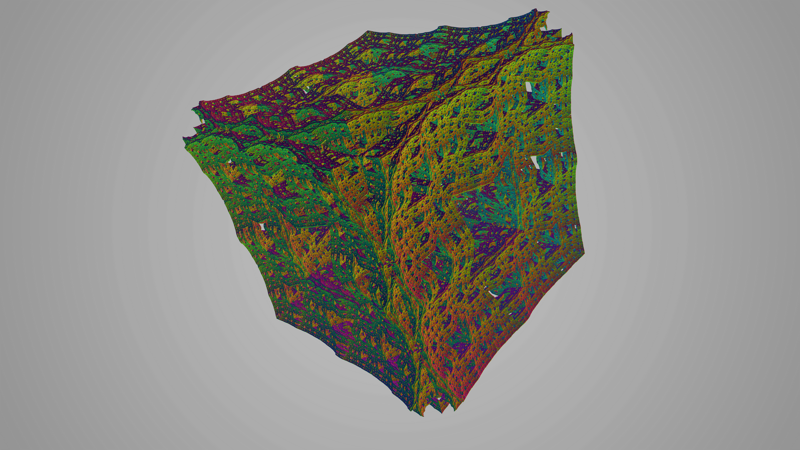
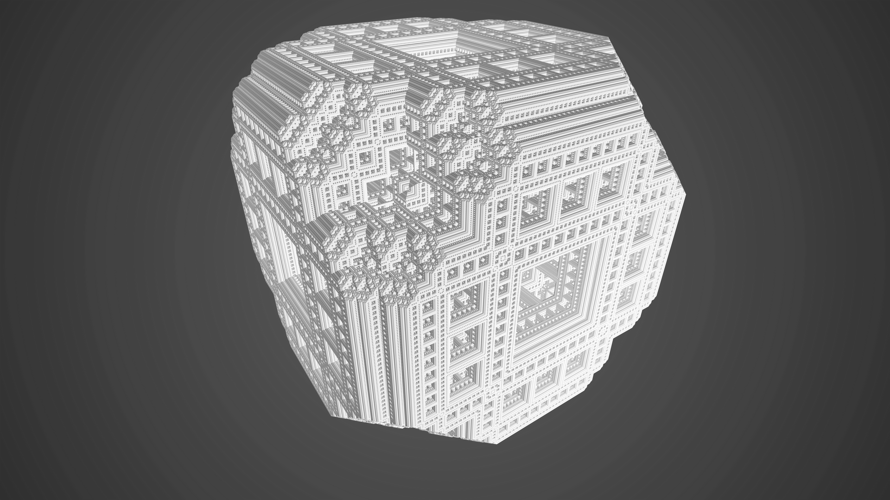
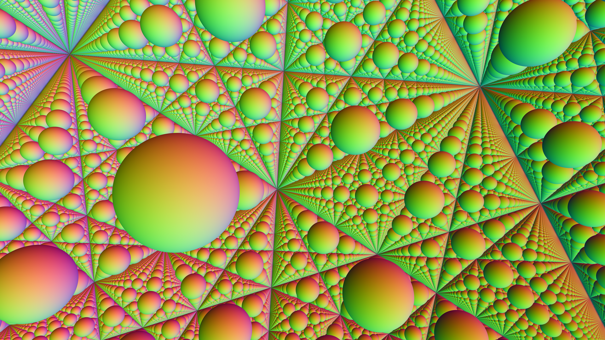
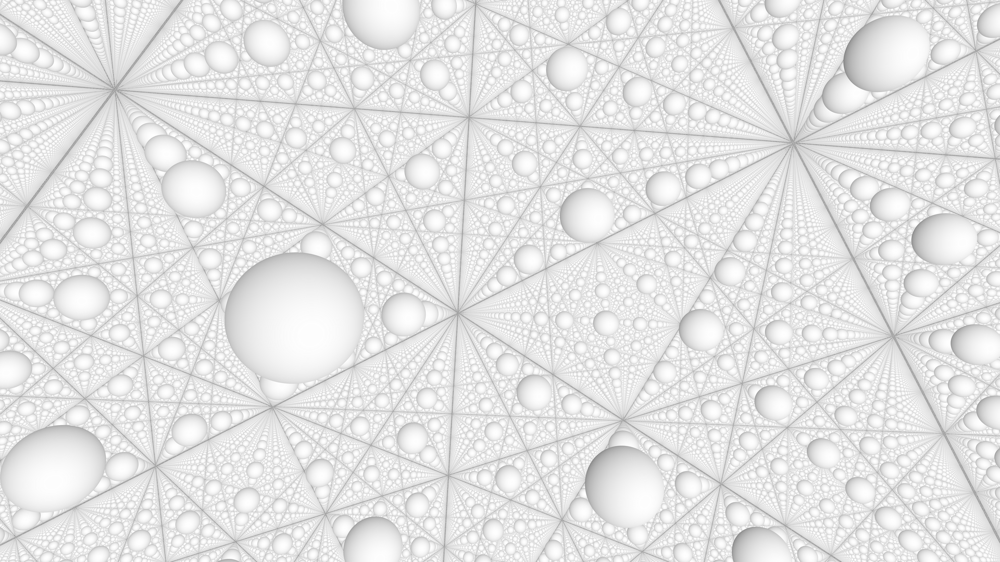
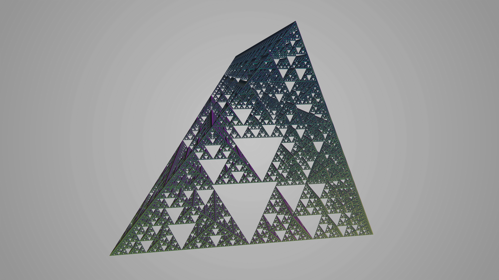
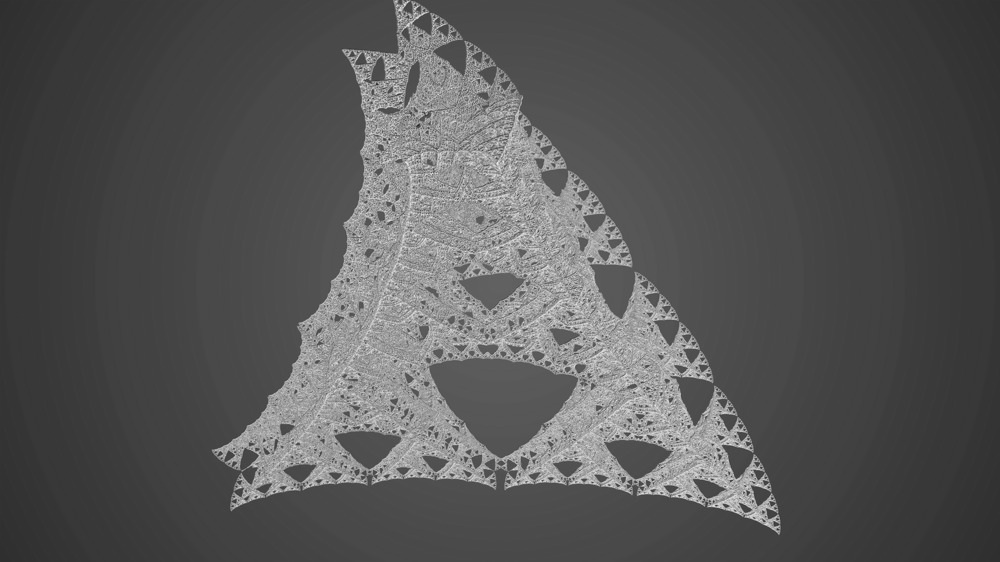
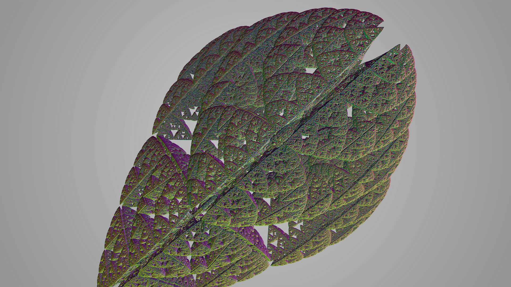

# rusty-days-hack
Repo for the [Rusty Days Hackathon 2020](https://rusty-days.org/hackathon/) with the topic "Emergent phenomena".

We explored creating fractals with ray marching in Rust with the help of these great resources:
- [Mikael Hvidtfeldt Christensen Blog](http://blog.hvidtfeldts.net/index.php/2011/06/distance-estimated-3d-fractals-part-i/)
- [The Art of Code Youtube Channel](https://www.youtube.com/watch?v=Ff0jJyyiVyw&list=PLGmrMu-IwbgtMxMiV3x4IrHPlPmg7FD-P)
- [Raymarching Workshop](https://github.com/electricsquare/raymarching-workshop)

The images can be created by running:
```sh
cargo run --release
```











